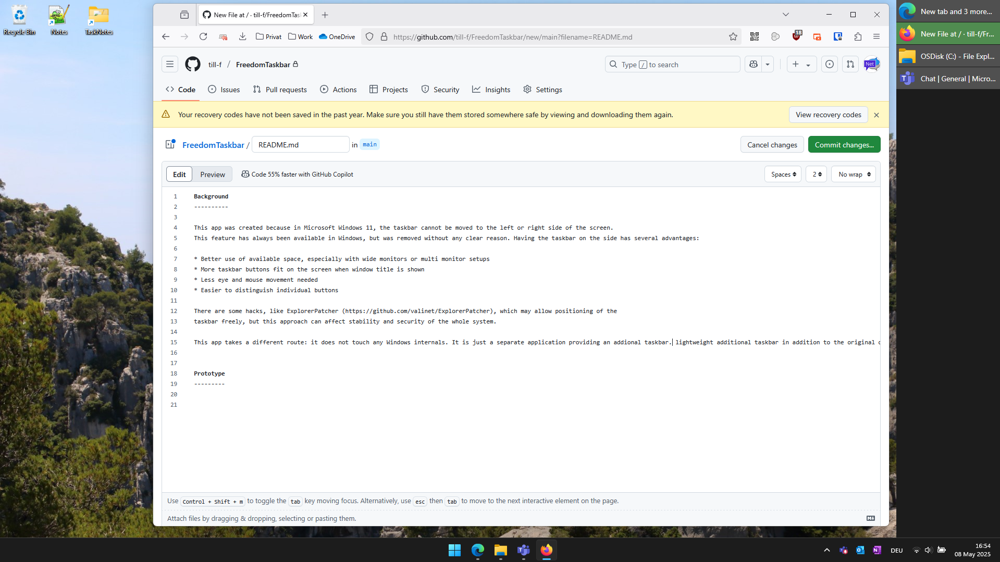

Background
==========

This application was created, because the taskbar of Microsoft Windows 11 cannot be moved to the left or the right side of the screen.
This feature has always been available in Windows, but was removed without a clear reason. Having the taskbar on the side has several advantages:

* Better use of available space, especially with wide monitors or multi monitor setups
* More taskbar buttons fit on the screen when window title is shown
* Less eye and mouse movement needed
* Easier to distinguish individual buttons

There are some hacks, like ExplorerPatcher (https://github.com/valinet/ExplorerPatcher), which may allow positioning of the original
taskbar freely, but this approach can affect stability and security of the whole system. It was also reported to break after some time and
some people even claim Microsoft actively fights against it.

FreedomTaskbar takes a different route: it does not touch any Windows internals. It is just a separate application providing an _addional_ taskbar.
It uses classical Win32 APIs to list open windows and to control the active window etc. Microsoft cannot break it without breaking thousands of other applications.

Note
====

This application is still a prototype. I hope I find some time for improvements. But even at its current state it already helps me a lot.

Supported Features
------------------

 - Showing an _additional_ taskbar on the right or left side of the primary screen
 - Free ordering of tasbar buttons
 - Highlighting of the active window
 - Special handling of maximized windows on the primary screen (shrinks them so that they are not hidden behind the taskbar application)
 - Starting a second instance of an application by Shift+Click a taskbar button
 - Closing a window or killing the application with a right click

Known Limitations:
------------------

 - If the taskbar is running with user priviledges (not as administrator), no icon is shown for applications that are running with elevated priviledges
 - Icon of some applications is not shown properly (this is related to previous limitation and could be fixed quite easily)
 - Windows Store Apps (also Calculater App, Settings App) are not shown

Wanted Features:
----------------

 - Pinning appliations
 - Remember ordering and grouping of applications
 - Cosmetic improvements, animations
